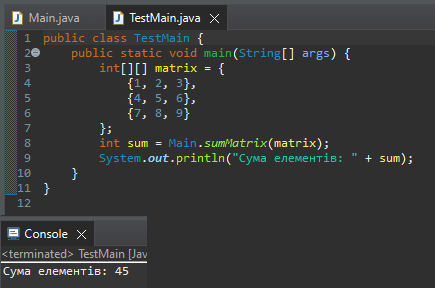

# Практична робота: Поглиблене використання масивів

## Завдання
5. Обчислити суму елементів матриці розміром N × M.

`Main.java`
```java
import java.util.Arrays;

/**
 * Клас містить метод для обчислення суми всіх елементів двовимірної матриці.
 */
public class Main {
    /**
     * Обчислює суму всіх елементів прямокутної матриці.
     * @param matrix двовимірний масив цілих чисел
     * @return сума всіх елементів
     */
    public static int sumMatrix(int[][] matrix) {
        return Arrays.stream(matrix)
                     .flatMapToInt(Arrays::stream)
                     .sum();
    }
}
```
---
`TestMain.java`
```java
/**
 * Клас для перевірки працездатності методу sumMatrix з класу Main.
 */
public class TestMain {

    public static void main(String[] args) {
        int[][] matrix = {
            {1, 2, 3},
            {4, 5, 6},
            {7, 8, 9}
        };

        int result = Main.sumMatrix(matrix);
        System.out.println("Сума елементів: " + result);
    }
}
```

## Результат тестування:

